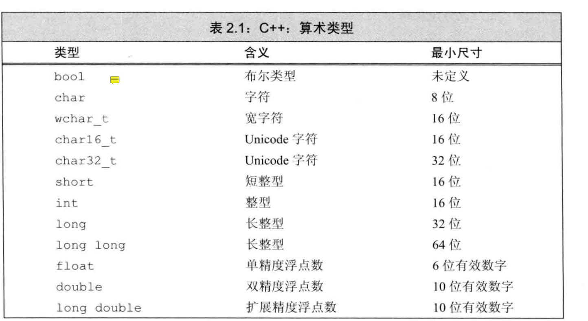
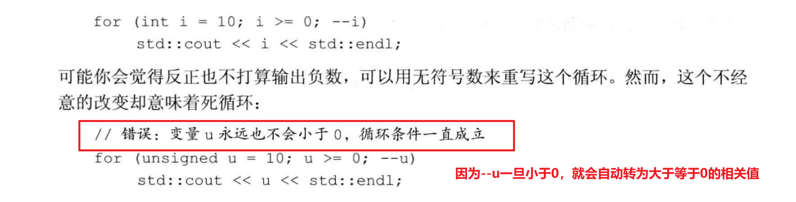

# 第一章

## 输入输出

C++包含了一个全新的标准库`iostream`，其中包含了两个基础类型`istream`和`ostream`分别表示输入流和输出流。

**流：**字符序列，从I/O设备读出或者写入IO设备

**四个标准输入输出对象：**

- 标准输入对象(istream)：cin
- 标准输出对象：cout
- 标准错误的ostream对象：cerr
- 一般性信息输出对象：clog

**对于来自标准库的头文件，应该用尖括号<>包围头文件名，对于不属于标准库的头文件，则用双引号""包围**

## 类

### 成员函数

**成员函数的调用：**

```c++
class Sales_item;
Sales_item item1;

item1.isbn(); // 调用isbn()成员函数（方法）
```

**.运算符：**名为item1的对象的isbn成员。只能用于类类型的对象。其左侧运算对象必须是一个类类型的对象。右侧运算对象必须是该类型的一个成员名（成员变量、成员函数）

`()调用运算符`：调用一个函数，里面可以传入参数，也可能为空。


## 自定义数据结构

**数据结构定义：**是把一组相关的数据元素组织起来，然后使用它们的策略和方法。

一个class类就是一个数据结构

### 类数据成员

类的数据成员定义类类的对象的具体内容，每个对象有自己的一份数据成员拷贝。修改一个对象的数据成员，不会影响其他对象

**C++11新标准规定，可以为数据成员提供一个类内初始值。默认初始化**

### 为什么需要在头文件中声明一个类？


**注意：**整个程序中的预处理变量包括头文件保护符必须唯一


# 第一部分：C++基础

## 变量和基本类型

### 基本内置类型

**什么是类型？**对象的类型定义了对象能包含的数据和参与的运算。

1. 算术类型
   - 整型
   - 浮点型
2. 空类型void



**一个字等于4或8字节 = 32或64位**

3. 复合类型：基于其他类型定义的类型
   - 引用
   - 指针

### **有符号类型和无符号类型**


### 类型选择


### 类型转换

1. 转换规则

   

2. **需要注意的问题：**

   

3. **含有无符号类型的表达式**

   > 会先将有符号类型通过取余的形式转为无符号类型

   

   

   

   **结论：`不要在表达式里出现无符号类型和带符号类型混用`**

### 字面值常量

**整型和浮点型字面值：**


**字符和字符串字面值：**

> 字符串字面值的类型实际上是由常量字符构成的数组。编译器会在每个字符串的结尾处添加一个空字符`\0`
>
> **因此，字符串字面值的实际长度要比它的内容多1**


**转义序列：**

- 不可打印的字符
- 转义序列


**通过转义序列输出字符：**

- \x后紧跟一个或多个十六进制数字，数字部分表示字符对应的数值
- \后紧跟1-3个八进制数字，其中数字部分表示的是字符对应的数值。

### **变量：**提供一个具名的、可供程序操作的存储空间

> 每个变量都有一个数据类型，决定着变量所占**内存空间的大小和布局方式、该空间能存储的值的范围，以及变量能参与的运算**
>
> **变量和对象一般可以互换使用**

**变量定义：**`类型说明符 变量名1，变量名2；` // 定义时还可以为一个或多个变量赋值

**初始值：**对象在创建时获得一个特定的值，称这个对象被**初始化**

**列表初始化（initializer list)：**

> **C11新特性：**能用花括号来初始化变量
>
> ```c++
> int units_sold = 0;
> int units_sold = {0};
> int units_sold{0};
> int units_sold(0);
> ```
>
> 对于内置类型的变量，如果使用列表初始化且初始值存在丢失信息的风险，则编译器将报错。
>
> ```c++
> long double ld = 3.1415926;
> int a{ld}, b = {ld}; // 错误：转换未执行，因为存在丢失信息的危险
> int c(ld), d = ld; // 正确：转换执行，且确实丢失了部分值
> ```

**默认初始化：**

> 如果定义变量时没有指定初值，则变量被默认初始化。此时变量被赋予了“默认值”

**错误的变量声明/定义：**

```c++
double salary = wage = 99.99; // error: ‘wage’ was not declared in this scope
```

### 变量声明和定义的关系

1. 为什么需要将声明和定义区分开来？

   > **为了支持分离式编译（允许将程序分割为若干个文件，每个文件可被独立编译）**

2. 声明：使得名字为程序所知，一个文件如果想使用别处定义的名字，则必须包含对那个名字的声明

3. 定义：负责创建与名字关联的实体

   > 变量声明规定了变量的类型和名字，而定义还身亲存储空间，也可能会为变量赋一个初始值
   >
   > 如果想声明一个变量而非定义它，就在变量名前添加关键字extern。而且不要显示的初始化变量；

```c++
extern int i; // 声明i而非定义i
int j;  // 声明并定义
extern double pi = 3.1416; // 定义
```

**变量和定义的区分？**

1. 任何包含了显示初始化的声明即成为定义。
2. 给extern关键字标记的变量赋一个初始值，就抵消了extern的作用。**extern语句如果包含初始值就不再是声明，而是定义**
3. 变量能且只能被定义一次，但是可以被多次声明

```c++
#include <iostream>

using namespace std;

void testFunc1()
{
    // 在函数体内部初始化一个extern标记的变量，将引发错误
    extern int i = 1; 
    // error: ‘i’ has both ‘extern’ and initializer
    return;
}

int main()
{
        int i; //定义
        extern int i; // 重复声明i，会报错

        testFunc1();

        return 0;
}
```

**如果要在多个文件中使用同一个变量，就必须将声明和定义分离。此时变量的定义必须出现且只能出现在一个文件中。而其他用到该变量的文件必须对其进行声明，却不能重复定义**

### 标识符

1. **C++标识符由字母、数字和下划线组成，并且必须以字母或下划线开头**

2. 用户自定义的标识符中**不能连续出现两个下划线**，也不讷讷个以下划线紧连大写字母开头
3. 定义在函数体外的标识符也不能以下划线开头

### 名字的作用域

同一个名字在不同的作用域中可能指向不同的实体，**名字的有效区域始于名字的声明语句，以声明语句所在的作用域末端为结束**

**作用域分类**

1. 全局作用域：一旦声明之后，在整个程序的范围内都可以使用
2. 块作用域


### 引用

**引用为`对象`起了另外一个名字**

右值引用和左值引用：

1. 引用必须被初始化

2. **引用并非对象，而是一个已经存在的对象的别名**

3. 因为引用不是对象，因此不能定义引用的引用

4. 引用类型的初始值必须是一个对象，不能与字面值或者某个表达式的计算结果绑定

   > `int &refVal = 10; //错误，引用类型的初始值必须是一个对象`

**引用的定义：**


### 指针

**指针和引用相比的不同之处：**

- 指针本身是一个对象，允许对指针进行赋值和拷贝
- 指针可以指向不同的对象
- 指针可以不初始化，这时候是一个野指针

**指针的类型和其所指向的数据类型必须匹配，如果指针指向了一个其他类型的对象，则对该对象的操作将发生错误**

**指针值的可能情况：**

- 指向一个对象
- 指向紧邻对象所占空间的下一个位置（`.end()`）
- 空指针：没有指向任何对象
- 无效指针

**得到空指针最直接的办法就是用字面值`nullptr`来初始化指针**。可以被转换成任意其他的指针类型

**NULL是预处理变量，可以用来给指针赋值。定义在`#include <cstdlib>`**

#### **void*指针：**


### 处理类型

#### 类型别名

定义类型别名的传统方法：`typedef`


**需要注意的问题：**


# 知识点总结

## C++基础知识

1. endl的作用

   > endl称为`操纵符`，写入效果是结束当前行，并且将与设备关联的缓冲区中的内容刷到设备中（相当于fflush?)
   >
   > 缓冲刷新操作可以保证到目前为止程序所产生的所有输出都真正写入到输出流中，而不是仅停留在内存中等待写入流
   
2. python是在程序运行时检查数据类型，而C++是一种静态数据类型语言。**类型检查发生在编译时期**

3. 指针和引用的区别

   - 指针本身是一个对象，而引用不是一个对象
   - 指针可以不用显示初始化，而引用必须显示初始化
   - 指针的大小和引用的大小不同
   - 存在指向指针的指针，而不存在指向引用的引用

### 命名空间namespace

1. 命名空间可以用来避免名字定义冲突，以及使用库中相同名字导致的冲突。标准库定义的所有名字都在命名空间std中

### 文件重定向


2. 将库定义的名字放在单一位置的机制

## 概念讨论

1. 初始化和赋值操作的区别

   > 对象在创建时获得一个特定的值，这一过程称为初始化。
   >
   > 而通过等号=进行赋值是一个不同的操作。只是将对象的当前值擦除，并用一个新值来替代

2. 静态类型

   

## 需要注意的问题

1. 默认初始化

   > 如果**定义变量时没有指定初始值，则变量会被默认初始化**。此时变量被赋予了“默认值”
   >
   > - 默认值到底是什么由变量类型决定
   > - 定义变量的位置也会对此有影响
   >
   > 如果是内置类型的变量未被显式初始化，则定义于任何函数体之外的变量被初始化为0，定义于函数体内部的内置类型变量将不被初始化（uninitialized）
   >
   > 一个未被初始化的内置类型变量的值是未定义的，如果试图拷贝或以其他形式访问此类值将引发错误。
   >
   > **结论：未初始化的变量含有一个不确定的值，大多数编译器使用未初始化变量的行为都会产生警告。并且可能发生未知的错误，因此应该为每一个变量进行初始化操作**

   ```c++
   #include <iostream>
   
   using namespace std;
   
   int ga;
   
   void myfunc()
   {
   	int b;
   
   	cout << "value of b = " << b << endl; //value of b = 非法值
   
   }
   
   int main()
   {
   	int a;
   	cout << "value of a = " << a << endl; // value of a = 0
   	cout << "value of ga = " << ga << endl;  // value of ga = 0
   	myfunc();
   
   	return 0;
   }
   ```

### 命名规范


**在涉及指针和引用的声明，一般有两种写法：**

1. 把修饰符(&,*)和变量标识符写在一起

2. 将修饰符（*,&）和类型名写在一起

   


### 初始化所有指针


**对于指针和引用的使用：**

- 不存在指向引用的引用、指针（因为引用不是一个对象）

  ```c++
  int a = 1;
  int &ra = a;
  int& *ptr = ra; //错误，不存在指向引用的指针
  int& &rra = ra; //错误，不存在指向引用的引用
  ```

- 可以有指向指针的指针，和指向指针的引用

  ```c++
  int i = 42;
  int *p = &i;
  int* &rptr = p;
  int* *pptr = &p; 
  ```

**对于一条比较复杂的指针或引用的声明语句，从右王座阅读有助于弄清楚它的真实含义**


## 关键字


### extern

**在头文件中声明，其作用是指明该变量并非本文件所独有。它的定义将在别处出现。（`不需要在本文件定义`）**

1. 在函数体内部，如果试图初始化一个extern关键字标记的变量，将引发错误
2. 如果想在多个文件之间共享const对象，必须在变量的定义之前添加`extern`关键字

### const关键字

1. 因为const对象一旦创建后其值就不能再改变，**因此const对象必须初始化**

2. const对象被设定为仅在文件内有效，当多个文件中出现了同名的const变量时，需要分别定义

   

**const的引用`常量引用`**

可以把引用绑定到const对象上，称之为`对常量的引用`。不能被用作修改它所绑定的对象

**指针和const**

- 指向常量的指针：不能用于改变其所指向的对象的值，只适合用来存放常量对象的地址

- const指针（**常量指针**）：因为指针本身是一个对象，所以可以用const修饰。

  > **常量指针必须被初始化**，一旦被初始化，其值不能再发生改变。即指针指向的地址不能够发生改变。但是该地址的对象可以发生改变

**顶层const：** 指针本身是一个常量

**底层const：**指针指向的对象是一个常量


**理解错误：声明引用的const都是底层const（`引用的对象无法修改`）**


### constexpr和常量表达式


**constexpr变量：**


1. **对于函数返回值作为常量的初始值的情形，需要定义`特殊的constexpr函数`**

2. 如果一个变量是一个常量表达式，就把它声明成`constexpr`

**指针和constexpr：**

> 在constexpr声明中如果定义了一个指针，限定符constexpr仅对指针有效，与指针所指的对象无关。
>
> ```c++
> const int *p = nullptr; // 指向常量的指针
> constexpr int *q = nullptr; // 说明q是一个常量指针
> ```
>
> 

**字面值类型：**


****

### auto类型说明符

在C++11中引入auto类型说明符，让编译器去分析表达式所属的类型。

**auto让编译器通过初始值来推算变量的类型。因此，`auto定义的变量必须有初始值`**

**auto关键字用于复合类型(`&, *`)、常量：**


### decltype类型指示符


**decltype和引用：**


## 术语表

- [ ] 参数（实参）：向函数传递的值

- [ ] 赋值：抹去一个对象的当前值，用一个新值取代之

- [ ] 程序块：零条或多条语句的序列，用花括号包围

- [ ] 缓冲区（buffer）：一个存储区域，用于保存数据，IO设施通常将输入（或输出的）数据保存在一个缓冲区中。读写缓冲区的动作与程序中的动作是无关的。我们可以显示地刷新输出缓冲（通过`endl`），以便强制将缓冲区中的数据写入输出设备。默认情况下，`cin`会刷新cout，程序非正常终止时也会刷新cout

- [ ] 内置类型（built-in type)由语言定义的类型

- [ ] 自定义数据类型：类class

- [ ] cerr：ostream对象

- [ ] 字符串常量

- [ ] 类：一种用于定义自己的数据结构及其相关操作的机制。最基本的特性之一

- [ ] 类类型：类定义的类型，**类名**

- [ ] **数据结构：**数据及其上所允许的操作的一种逻辑组合（tree，map，set）

- [ ] 编辑-编译-调试：使程序能够正确执行的开发过程

- [ ] 文件结束符（end-of-file`EOF`）：系统特定的标识，指出文件中无更多数据了

- [ ] 表达式：最小的计算单元。一个表达式包含一个或多个运算对象，通常还包括一个或多个运算符。

- [ ] **函数：**具名的计算单元

- [ ] **函数体：**语句块，定义了函数的执行动作

- [ ] 函数名：函数被用来调用的接口

- [ ] 头文件：使类或其他名字的定义可被多个程序使用的一种机制。程序通过#include指令使用头文件

- [ ] **初始化：**在一个对象创建的时候赋予它一个值

- [ ] iostream头文件：提供了面向流的输入输出的标准库类型

- [ ] istream：提供了面向流的输入的库类型

- [ ] 库类型：标准库定义的类型，如istream

- [ ] **形参列表：**函数定义的一部分，指出调用函数时可以使用什么样的实参。可能为空列表

- [ ] 返回类型

- [ ] 源文件：包含C++程序的文件

- [ ] 对象：指一块能存储数据并具有某种类型的内存空间

  

  

