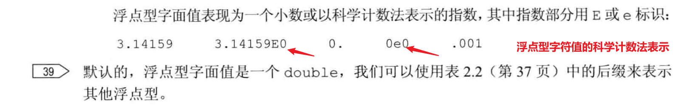
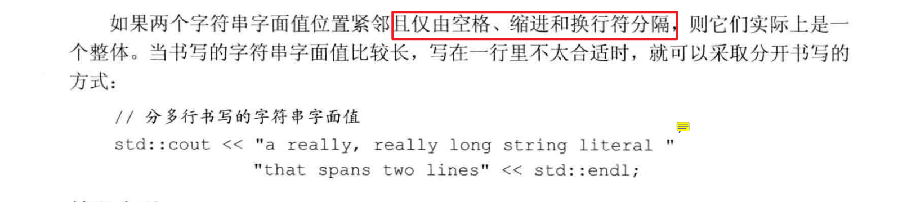

# 第一章

## 输入输出

C++包含了一个全新的标准库`iostream`，其中包含了两个基础类型`istream`和`ostream`分别表示输入流和输出流。

**流：**字符序列，从I/O设备读出或者写入IO设备

**四个标准输入输出对象：**

- 标准输入对象(istream)：cin
- 标准输出对象：cout
- 标准错误的ostream对象：cerr
- 一般性信息输出对象：clog

**缓冲区：**

## 类

### 成员函数

**成员函数的调用：**

```c++
class Sales_item;
Sales_item item1;

item1.isbn(); // 调用isbn()成员函数（方法）
```

**.运算符：**名为item1的对象的isbn成员。只能用于类类型的对象。其左侧运算对象必须是一个类类型的对象。右侧运算对象必须是该类型的一个成员名（成员变量、成员函数）

`()调用运算符`：调用一个函数，里面可以传入参数，也可能为空。

# 第一部分：C++基础

## 变量和基本类型

### 基本内置类型

**什么是类型？**对象的类型定义了对象能包含的数据和参与的运算。

1. 算术类型
   - 整型
   - 浮点型
2. 空类型void


**一个字等于4或8字节 = 32或64位**

### **有符号类型和无符号类型**


### 类型选择


### 类型转换

1. 转换规则

   

2. **需要注意的问题：**

   

3. **含有无符号类型的表达式**

   > 会先将有符号类型通过取余的形式转为无符号类型

   

   

   

   **结论：`不要在表达式里出现无符号类型和带符号类型混用`**

### 字面值常量

**整型和浮点型字面值：**





**字符和字符串字面值：**

> 字符串字面值的类型实际上是由常量字符构成的数组。编译器会在每个字符串的结尾处添加一个空字符`\0`
>
> **因此，字符串字面值的实际长度要比它的内容多1**



**转义序列：**

- 不可打印的字符
- 转义序列


# 知识点总结

## C++基础知识

1. endl的作用

   > endl称为`操纵符`，写入效果是结束当前行，并且将与设备关联的缓冲区中的内容刷到设备中（相当于fflush?)
   >
   > 缓冲刷新操作可以保证到目前为止程序所产生的所有输出都真正写入到输出流中，而不是仅停留在内存中等待写入流
   
2. python是在程序运行时检查数据类型，而C++是一种静态数据类型语言。**类型检查发生在编译时期**

### 命名空间namespace

1. 命名空间可以用来避免名字定义冲突，以及使用库中相同名字导致的冲突。标准库定义的所有名字都在命名空间std中
2. 将库定义的名字放在单一位置的机制

## 术语表

- [ ] 参数（实参）：向函数传递的值
- [ ] 赋值：抹去一个对象的当前值，用一个新值取代之
- [ ] 程序块：零条或多条语句的序列，用花括号包围
- [ ] 缓冲区（buffer）：一个存储区域，用于保存数据，IO设施通常将输入（或输出的）数据保存在一个缓冲区中。读写缓冲区的动作与程序中的动作是无关的。我们可以显示地刷新输出缓冲（通过`endl`），以便强制将缓冲区中的数据写入输出设备。默认情况下，`cin`会刷新cout，程序非正常终止时也会刷新cout
- [ ] 内置类型（built-in type)由语言定义的类型
- [ ] 自定义数据类型：类class
- [ ] cerr：ostream对象
- [ ] 字符串常量
- [ ] 类：一种用于定义自己的数据结构及其相关操作的机制。最基本的特性之一
- [ ] 类类型：类定义的类型，**类名**
- [ ] **数据结构：**数据及其上所允许的操作的一种逻辑组合（tree，map，set）
- [ ] 编辑-编译-调试：使程序能够正确执行的开发过程
- [ ] 文件结束符（end-of-file`EOF`）：系统特定的标识，指出文件中无更多数据了
- [ ] 表达式：最小的计算单元。一个表达式包含一个或多个运算对象，通常还包括一个或多个运算符。
- [ ] **函数：**具名的计算单元
- [ ] **函数体：**语句块，定义了函数的执行动作
- [ ] 函数名：函数被用来调用的接口
- [ ] 头文件：使类或其他名字的定义可被多个程序使用的一种机制。程序通过#include指令使用头文件
- [ ] **初始化：**在一个对象创建的时候赋予它一个值
- [ ] iostream头文件：提供了面向流的输入输出的标准库类型
- [ ] istream：提供了面向流的输入的库类型
- [ ] 库类型：标准库定义的类型，如istream
- [ ] **形参列表：**函数定义的一部分，指出调用函数时可以使用什么样的实参。可能为空列表
- [ ] 返回类型
- [ ] 源文件：包含C++程序的文件
- [ ] 

